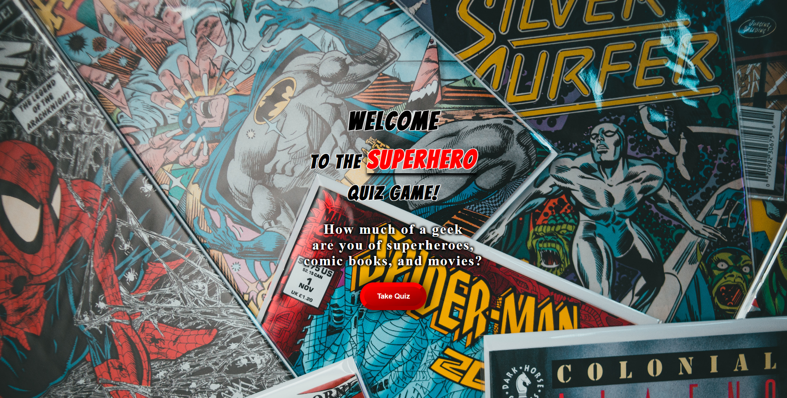
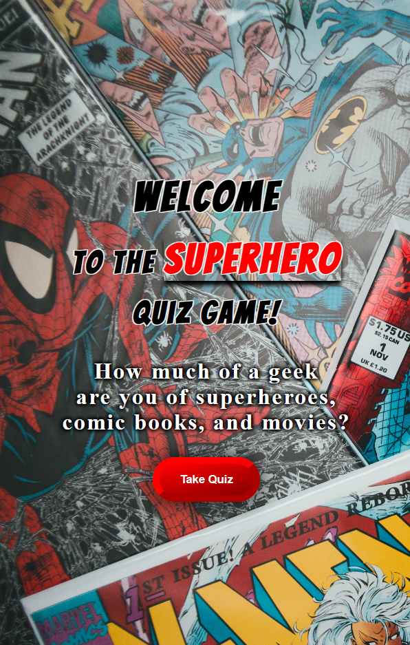
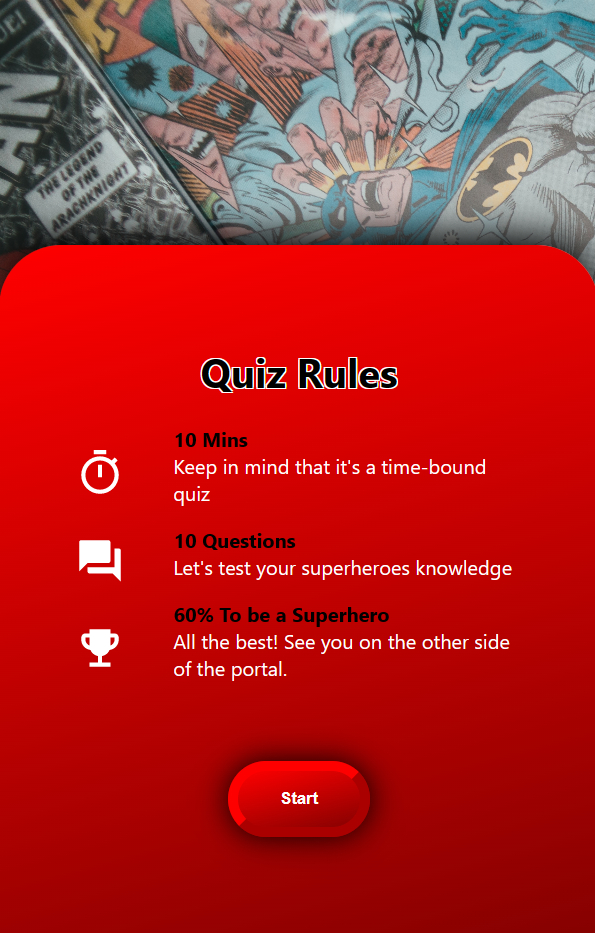
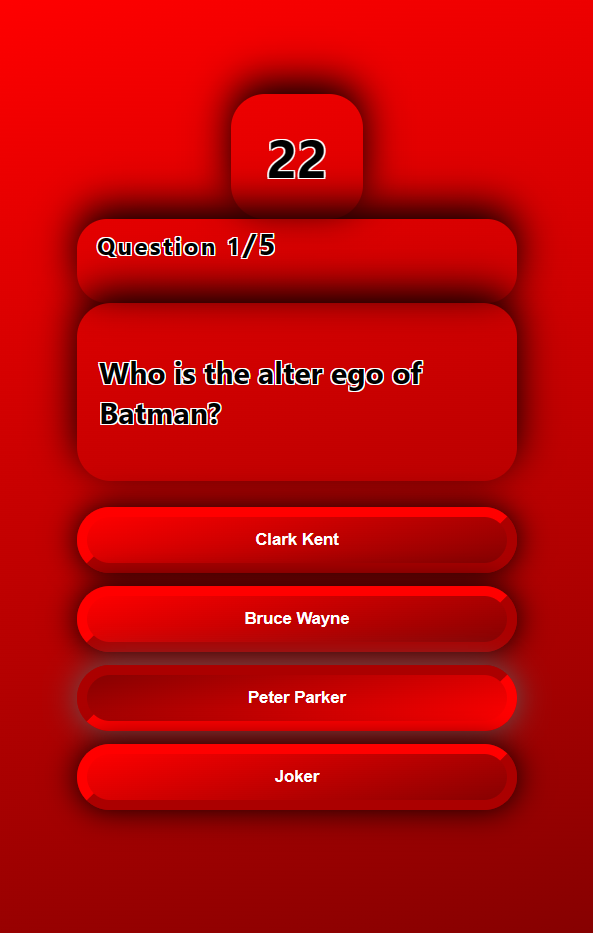
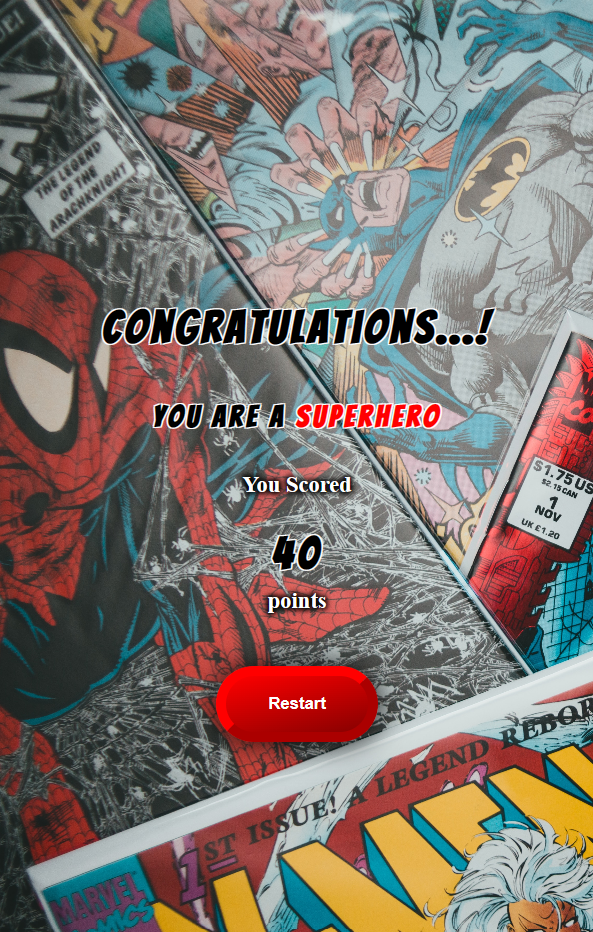

# Time Bound Quiz Web UI From Merchify in React

This is a React project I have made a quiz game in which there is a time bound and a welcome screen, a rules explaining page, the questions screen, and the end screen.

## Table of contents

-   [Overview](#overview)
    -   [The Theme](#the-theme)
    -   [Screenshot](#screenshot)
    -   [Links](#links)
-   [My process](#my-process)
    -   [Built with](#built-with)
    -   [What I learned](#what-i-learned)
    -   [Continued development](#continued-development)
    -   [Useful resources](#useful-resources)
-   [Author](#author)

## Overview

### The Theme

Users should be able to:

-   A Quiz Detail Screen from which the user can start the quiz.
    -   A simple UI where the user can see information about the quiz and start the quiz will suffice.
-   A Quiz Attempt Screen where the user will take the quiz.
    -   The quiz will have multiple MCQ questions with one correct answer for each question.
    -   The quiz must be time bound, i.e. the user will have 30 seconds to complete the quiz, after which it should auto submit.
-   Play the trailer when the image card is clicked and stop the trailer when again clicked on the image.
    -   A simple UI showing the user’s score.

### Screenshot

| Desktop Main Page                                                     |
| --------------------------------------------------------------------- |
|  |

| Mobile Welcome Screen                                                         | Mobile Rules Screen                                                          |
| ----------------------------------------------------------------------------- | ---------------------------------------------------------------------------- |
|      |       |
| Mobile Question Screen                                                        | Mobile End Screen                                                            |
| -----------------------------------------------------------------------       | ---------------------------------------------------------------------------- |
|  |           |

### Links

-   [Github Solution](https://github.com/ShivamManiMaurya/Time-bound-Quiz-Web-UI-from-Merchify)
-   [Live Site](https://lucky-torte-4691b5.netlify.app/)

## My process

### Built with

-   Mobile First Approach
-   HTML5
-   CSS custom properties
-   Flexbox
-   JavaScript
-   [React](https://reactjs.org/) - JS library

### What I learned

-   Get more familiar with useEffect hook and its different ways.
-   Get more familiar with transition and transform CSS property.
-   Get more familiar with animations in CSS.
-   Get more familiar with mobile first approach.
-   Get more familiar with setTimeout andn setInterval functions.

### Continued development

In this project, I also wanted to do a round or linear progress bar for the timer and I also wanted to add randomised questions and answers when restarted the quiz.

### Useful resources

-   [Akshay Saini](https://www.youtube.com/@akshaymarch7) - Akshay Saini bhaiya helped me in understanding javascript concepts
-   [Sonny Sangha](https://www.youtube.com/@SonnySangha) - A very special thanks to Sonny Sangha as well who helped me in getting more familiar with react useEffect hook and other concepts as well.

## Author

-   Website - [Shivam Maurya](https://shivammanimaurya.github.io/my_portfolio_website/)
-   GitHub Page - [Shivam Maurya GitHub](https://github.com/ShivamManiMaurya)
-   Linkedin - [@shivammanimaurya](https://www.linkedin.com/in/shivammanimaurya)
